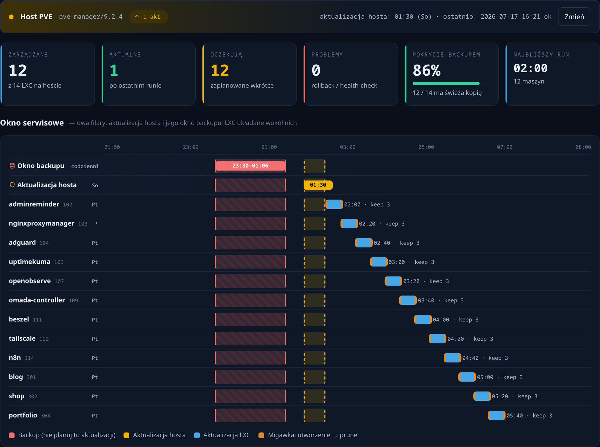
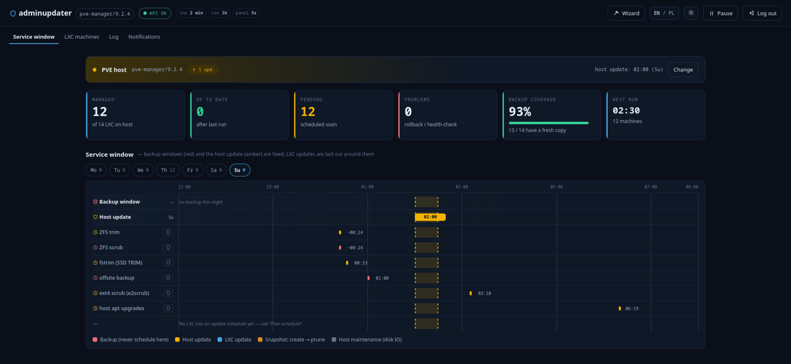
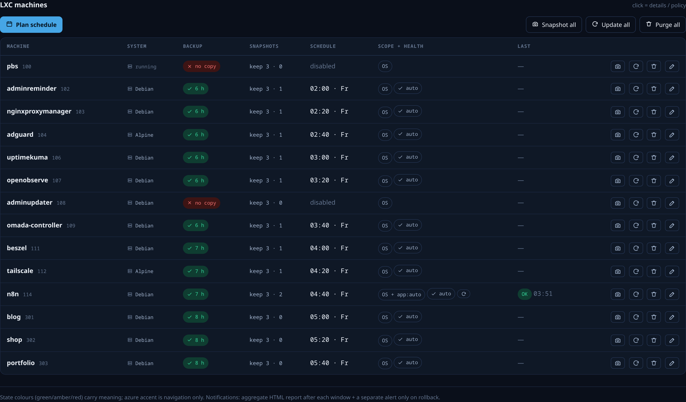
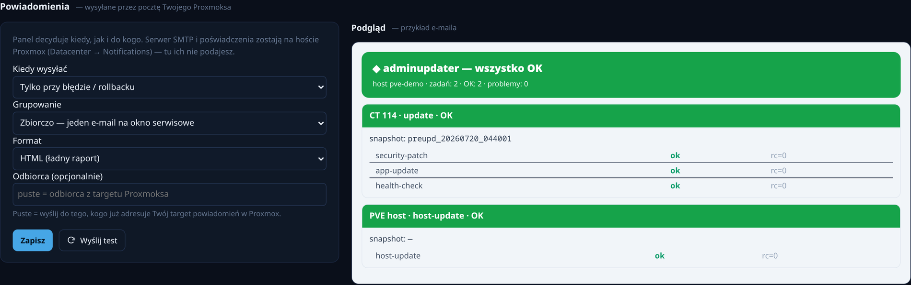

# proxmox-adminupdater

**Agentless, scheduled updates for your Proxmox LXC fleet — no SSH into the guests, no agent inside them.**

Applies **OS security patches** and runs **per-app update recipes** inside your
containers on a schedule, with a **pre-update snapshot** for one-click rollback —
all driven from a clean web UI. Think of it as scheduled `apt upgrade` + the
community-scripts "update" step, fleet-wide, without touching each guest by hand.

Sibling project to [`proxmox-autosnap`](https://github.com/Kr1sCode/proxmox-autosnap);
it reuses the same config/schedule/UI lineage.

## Screenshots

**Service window** — the mission-control view, a full **week view** (Mon–Sun tabs,
each with its LXC-update count). The anchors are drawn to scale from real data: every
detected **backup window** in red — its true duration learned from the PVE task
history, so a job that runs 23:00→01:22 across midnight blocks the whole span — and
the **PVE host update** in amber. **Other scheduled host maintenance** competing for
disk IO (ZFS scrub/trim, mdadm check, e2scrub, fstrim, unattended apt, offsite
backups) shows per-night as read-only rows you can one-click "avoid". Each enrolled
LXC is laid out around them (snapshot → update → prune, time, retention). A live
API/executor watchdog and refresh-cadence counters sit in the header. EN/PL and
light/dark built in.



**Every night, even the quiet ones** — pick any night to see exactly what touches
the disks then. Here Sunday has no backup and no LXC updates, so it is the calmest
window; the amber column is the host update, and the grey/host-maintenance ticks are
the only competition. Nothing is hidden just because it is empty.



**LXC machines** — the fleet table: per-guest backup freshness, snapshot count,
update scope + health-check, its scheduled **night + time**, and one-click Snapshot /
Update / Purge / Edit. The example shows the whole fleet **spread across the week**
(Mo–Su) with auto app-update (`app:auto`) and an auto health-check.



**Notifications** — pick when to send (every run / only failures / never), the
grouping (one digest per service window, or one e-mail per machine) and the format
(HTML or plain text), with a live preview and a one-click **Send test**. Delivery
rides your Proxmox mail transport — the SMTP server and credentials stay on the host.



> Screenshots use anonymized demo data.

## Why the split brain (and why there IS a host component)

Proxmox exposes **no REST API to run a command inside an LXC** — the guest-agent
`exec` exists only for QEMU VMs. So with **no SSH and no in-guest agent**, the
*only* way into a container is `pct exec` / `pct snapshot`, which are **host-side**.

adminupdater embraces that honestly and splits into two pieces:

| Component | Where | Role |
|---|---|---|
| **Brain** | unprivileged Debian 13 **LXC** | web UI, per-guest schedule, computes the plan, stores reports. Talks to PVE read-only (`VM.Audit`). |
| **Executor** | **PVE host** (~1 script + timer) | pulls the plan, `pct snapshot` + `pct exec` per job, posts results back. Stateless and dumb. |

Unlike autosnap, this **does** leave a small footprint on the host — that is
unavoidable for agentless in-guest execution. It is a single script + timer, so
it survives PVE upgrades.

## Security model

- **Host-authoritative whitelist.** A guest is touched only if its CTID is in
  `allowed_ctids` in `/etc/proxmox-adminupdater/host.conf` on the host. The LXC
  can *request*, never *force*. Starts **empty** — opt-in per container.
- **No raw commands cross the wire.** The plan carries only an **action enum**
  (`security-patch` / `app-update`) + CTID + recipe *name*. The host builds the
  actual command itself, so a compromised LXC cannot inject `rm -rf` — at worst
  it asks for a patch on a guest the host already permits. Never host root.
- **App recipes are host-trusted.** Update scripts live on the host
  (`/etc/proxmox-adminupdater/recipes/<name>.sh`) and are `pct push`ed into the
  guest at run time; the LXC only supplies the name.
- **Bearer-authed plan/report**, shared secret between LXC and host.
- **Pre-update snapshot** + optional **rollback on failure**.

## Install

Run on a Proxmox VE host:

```bash
bash -c "$(curl -fsSL https://raw.githubusercontent.com/Kr1sCode/proxmox-adminupdater/main/install.sh)"
```

It creates the LXC, provisions a read-only API token, installs the brain, and
drops the host executor + timer. Then:

1. Open `http://<container-ip>/`, log in with your Proxmox credentials.
2. Per guest: enable, pick a schedule, choose **security patches** and/or an
   **app recipe**, keep **pre-snapshot** on.
3. On the host, allow each opted-in CTID in `/etc/proxmox-adminupdater/host.conf`
   — `allowed_ctids = 101,105` for a set, or `allowed_ctids = *` to trust the
   panel. Changes apply on the **next timer tick** (no restart needed).

## End-to-end: what one scheduled run does

For a guest that is enabled, due, and allowed by the host, a single run is one
atomic unit under one rollback point:

```
① schedule           panel (Edit modal): mode + times/weekdays or interval
                     → stored per guest; the LXC computes "due" live via is_due
② plan               host timer → GET /plan → ONE job per due guest:
                       { ctid, actions:[security-patch, app-update], app, … }
③ pre-snapshot       host: pct snapshot preupd_YYYYMMDD_HHMMSS   (once)
④ detect OS          host: pct exec … cat /etc/os-release → debian|ubuntu|alpine|arch
⑤ security patches   host: pct exec …  apt-get upgrade / apk upgrade / pacman -Syu
⑥ app update         host: pct push <recipe> → pct exec …  (community-scripts `update`,
                       docker compose pull/up, …)
⑦ report             host → POST /report → LXC stores status + per-step log + history;
                       last_run set → guest no longer "due" (idempotent)
```

Ordering guarantees: **snapshot first**, then OS detection, then patches, then the
app recipe, then an optional **health-check**. If any step exits non-zero the chain
stops; with `rollback_on_fail` the guest is rolled back to that one pre-snapshot
(the app step never runs on a half-patched box). The host timer is the only clock.

## Health-check (verify, don't just trust the exit code)

A per-guest probe runs **after** the updates. If it fails, the run is failed and
rolled back — even when `apt`/`apk` returned 0. Structured (no raw commands cross
from the LXC); the host builds the command:

- `systemd` + `nginx` → `systemctl is-active --quiet nginx`
- `http` + `http://127.0.0.1/health` → `curl -fsS --max-time 10 <url>`

## Scheduled snapshots (autosnap built in)

Beyond pre-update snapshots, each guest has an **independent snapshot schedule**
(interval or calendar), decoupled from updates: its own clock, `auto_` prefix,
`keep`/`max_age_days` retention, and **dry-run**. So adminupdater covers both jobs
— scheduled snapshots *and* scheduled updates — from one panel.

## Schedule planner (fits updates around your backups)

Rather than hand-picking a time per guest and hoping it doesn't clash with a
backup, click **Plan schedule**. adminupdater reads the host's **learned backup
windows** (from the vzdump/PBS jobs it already inventories) plus the host-update
slot, then lays every enrolled guest into spaced slots inside a maintenance
window — **skipping every blocked window**, honouring a per-guest **spacing** and
a **concurrency** cap (default 1, i.e. serialize — kind to spinning disks).
Preview the placement, then **Apply** to write it back to the guests.

The same knowledge guards manual edits: saving a calendar time that lands inside
a detected backup window is refused with a clear prompt (you can still force it).

## Ad-hoc actions (do it now)

Every row has one-click **Snapshot now**, **Update now**, and **Purge snapshots**;
the toolbar has the bulk equivalents. These ride the same pull model — the panel
enqueues a one-shot job, the host executor picks it up on its next tick (≤ a few
minutes) and reports back, clearing it. **Purge** deletes only managed snapshots
(`preupd_`/`auto_`, strict `name_YYYYMMDD_HHMMSS` match) — manual snapshots are
physically safe. The host ctid whitelist gates ad-hoc jobs exactly like scheduled
ones: a compromised LXC can *request*, never *force*.

## Email report (via the Proxmox host's mail)

After each run the host executor sends a report through the **host's own mail
transport** — it reuses the SMTP target you configured in Proxmox (Datacenter →
Notifications), so credentials are never entered twice and never live in the panel.

Everything else is set from the **Notifications** tab in the UI: **when** (every run
/ only on failure+rollback / never), **grouping** (one digest per service window, or
one e-mail per machine), **format** (styled **HTML** or **plain text**), an optional
recipient override, a live preview and a **Send test** button. The executor picks
these up on its next tick. (`host.conf` `notify_email` / `notify_on` still work as a
fallback if the panel leaves them at defaults.)

Each report **decodes the exit code** it shows (`rc=137`, `rc=113`, …) in **Polish and
English** with what to actually do about it — e.g. `rc=137` → out of memory, raise the
container's RAM; `rc=113` → the guest is under-provisioned for the update.

## Temporary RAM boost during updates

Some app updates **build from source** — `npm install`, native compiles — and a small
container runs out of memory mid-build. The update then fails with **`rc=137`** (the
kernel OOM-killer) or **`rc=113`** (some community-scripts updaters self-abort when
under-provisioned), even though there is nothing wrong with the app.

Tick **“Temporarily raise RAM during updates”** in a container's policy (LXC machines →
edit) and adminupdater raises **that** container's RAM to the floor you set there **only
for the app-update step**, then restores the original value afterwards — whether the update succeeds,
fails or rolls back. It only ever *raises* (a container that is already generous is left
alone), and the **Proxmox host clamps the ceiling** with `ram_boost_max_mb` in
`host.conf`, so a compromised panel can never set an absurd limit on a guest. The boost
is shown in the e-mail report (`RAM 1024→4096 MB`). The setting is **per container** — a
build-heavy n8n gets 4–6 GB for the build, a tiny AdGuard needs none; containers that
never had it set fall back to the global `settings.ram_boost` / `ram_boost_mb` defaults
in `config.json`.

## App recipes

Drop `<name>.sh` in `/etc/proxmox-adminupdater/recipes/` on the host and set the
guest's app recipe to `<name>` in the panel. For community-scripts containers the
recipe is usually just `update` (their in-guest helper). See
`host/recipes/example-app.sh`.

## Uninstall

```bash
bash uninstall.sh <CTID>
```

Removes the container, host executor/timer, and API token. Pre-update snapshots
in guests are left untouched.

## Layout

```
app/       core.py · adminupdater.py · web.py · static/     (runs in the LXC)
host/      executor · systemd unit + timer · recipes/       (runs on the PVE host)
systemd/   adminupdater-web.service                         (LXC)
install.sh · uninstall.sh · config/config.example.json
```

## License

**Free for non-commercial / homelab use** — see [LICENSE](LICENSE).

You may use, run, modify and share adminupdater for any non-commercial purpose:
personal use, your own homelab, hobby, research, education and evaluation.
**Commercial use** (inside a for-profit organisation's operations, or to provide a
paid product/service) requires a separate commercial licence from the author —
open an issue on this repository to arrange one.
