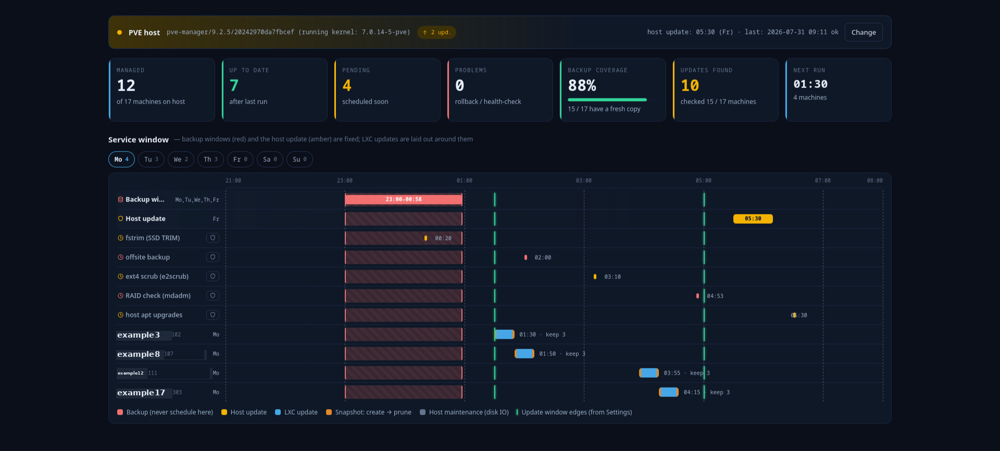
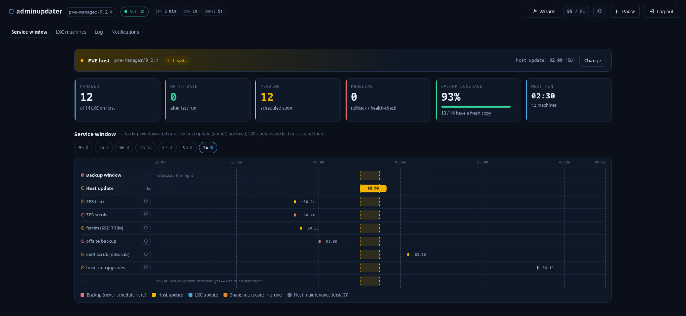
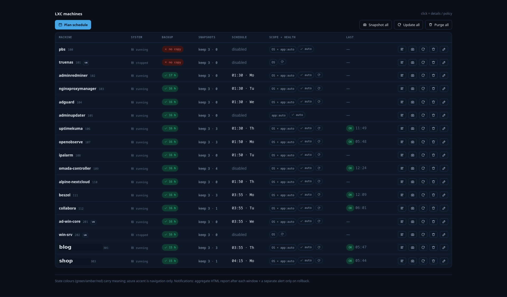
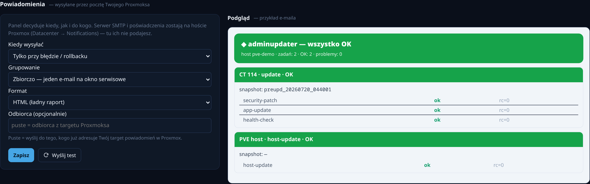
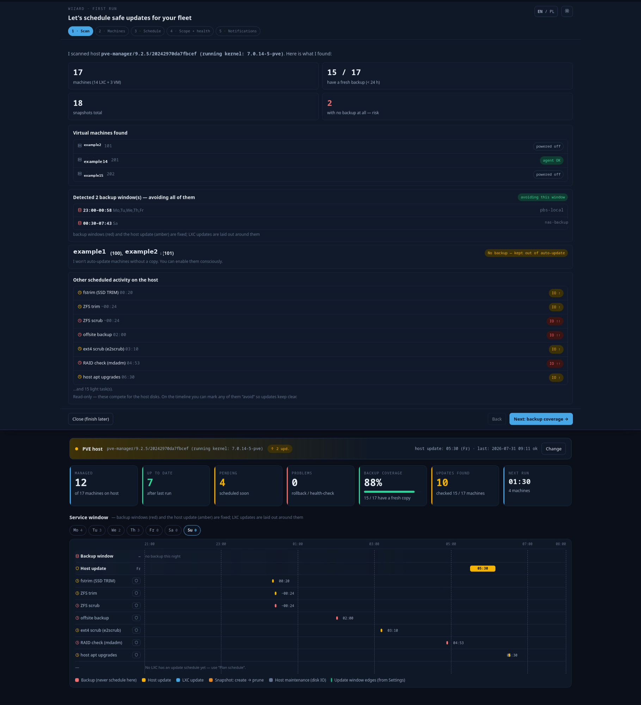
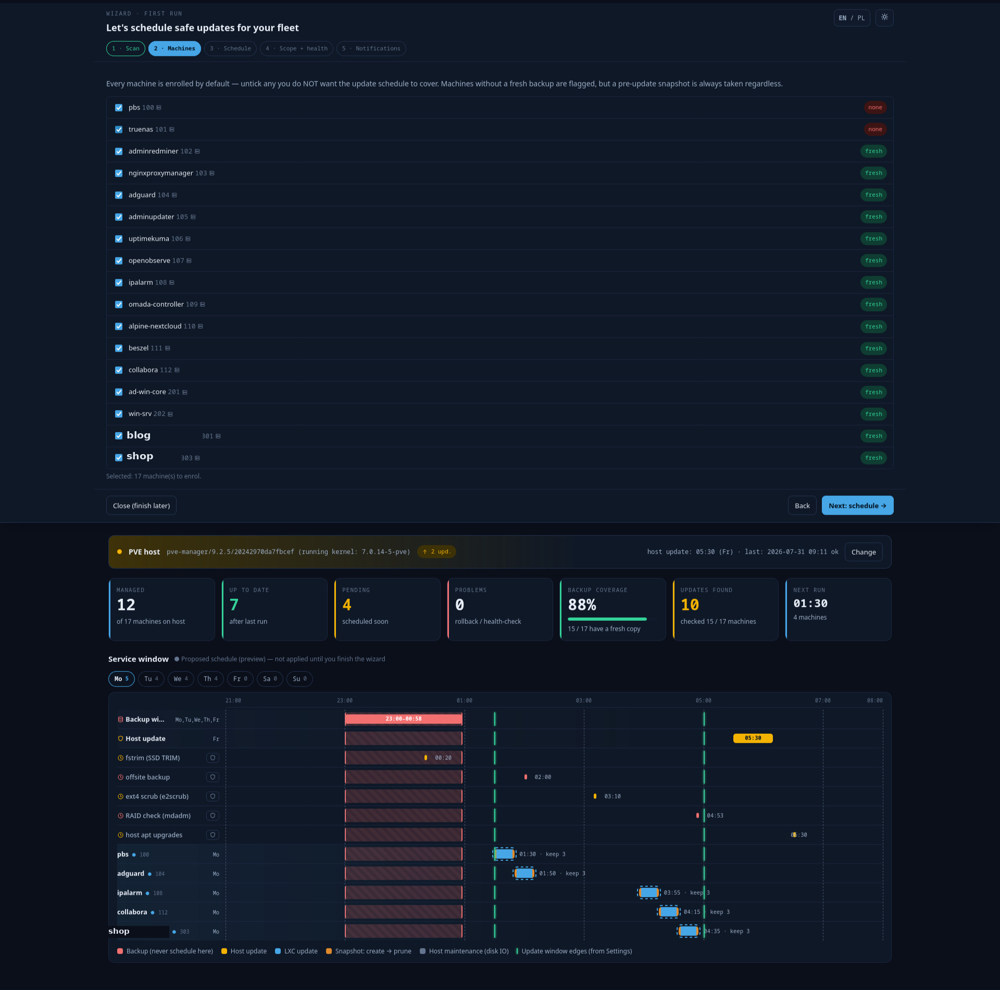
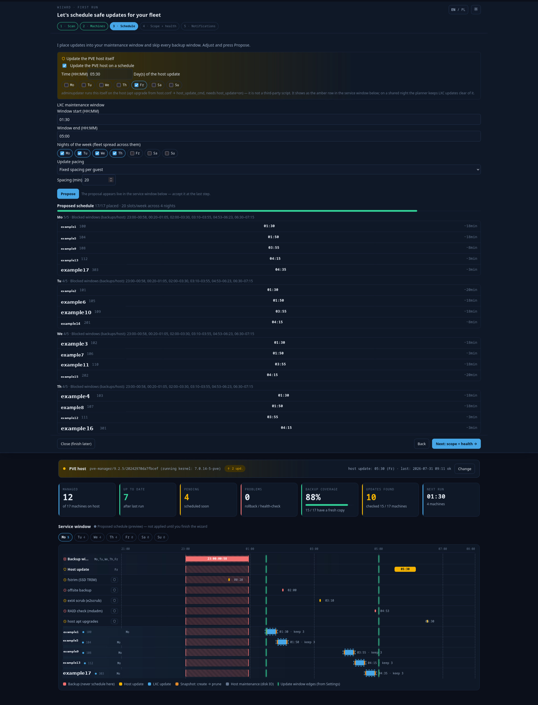
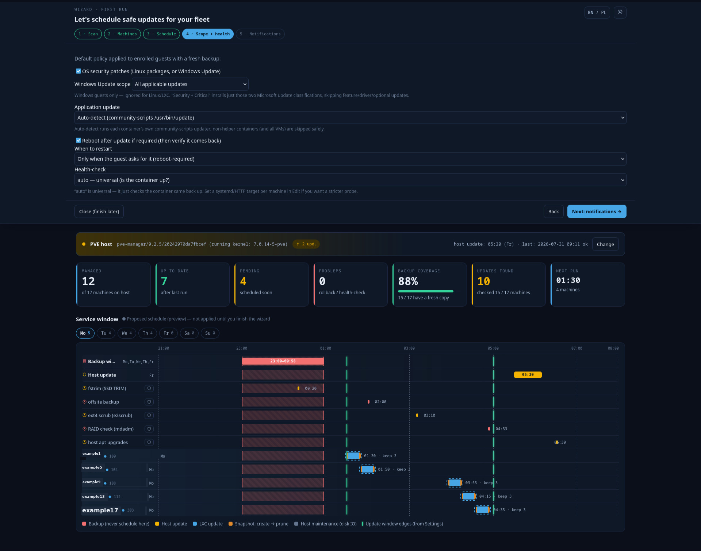
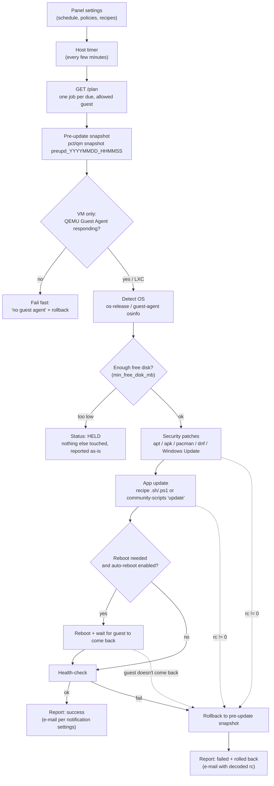

# proxmox-adminupdater

**Scheduled updates for your whole Proxmox fleet — LXC containers and QEMU VMs
(Linux, auto-detected distro, and Windows) alike — no SSH, driven from a clean web UI.**

Applies **OS security patches** and runs **per-app update recipes** on a
schedule, with a **pre-update snapshot** and **rollback on failure** for every
guest. Think of it as scheduled `apt upgrade`/Windows Update + the
community-scripts "update" step, fleet-wide, without logging into each guest by
hand. LXC needs nothing extra — it rides `pct exec`. A QEMU VM needs its
**QEMU Guest Agent** running (Proxmox's own mechanism, not an agent of ours) —
the panel flags any VM missing one instead of silently skipping it.

Sibling project to [`proxmox-autosnap`](https://github.com/Kr1sCode/proxmox-autosnap);
it reuses the same config/schedule/UI lineage.

## Screenshots

**Service window** — the mission-control view, a full **week view** (Mon–Sun tabs,
each with its guest-update count). The anchors are drawn to scale from real data: every
detected **backup window** in red — its true duration learned from the PVE task
history, so a job that runs 23:00→01:22 across midnight blocks the whole span — and
the **PVE host update** in amber. **Other scheduled host maintenance** competing for
disk IO (ZFS scrub/trim, mdadm check, e2scrub, fstrim, unattended apt, offsite
backups) shows per-night as read-only rows you can one-click "avoid". The thin
**green ticks** mark the configured update window's own start/end (from Settings) —
live, so editing the window moves them immediately. Each enrolled guest (LXC or VM)
is laid out around all of that (snapshot → update → prune, time, retention). A live
API/executor watchdog and refresh-cadence counters sit in the header. EN/PL and
light/dark built in.



**Every night, even the quiet ones** — pick any night to see exactly what touches
the disks then. Here Sunday has no backup and no guest updates, so it is the calmest
window; the amber column is the host update, and the grey/host-maintenance ticks are
the only competition. Nothing is hidden just because it is empty.



**Fleet table** — LXC containers and QEMU VMs side by side (the `VM` tag marks a
QEMU guest): per-guest backup freshness, snapshot count, update scope +
health-check, its scheduled **night + time**, and one-click Snapshot / Update /
Purge / Edit. The example shows the whole fleet **spread across the week** (Mo–Su)
with auto app-update (`app:auto`) and an auto health-check.



**Notifications** — pick when to send (every run / only failures / never), the
grouping (one digest per service window, or one e-mail per machine) and the format
(HTML or plain text), with a live preview and a one-click **Send test**. Delivery
rides your Proxmox mail transport — the SMTP server and credentials stay on the host.



### The setup wizard

First run (or **Settings → Wizard**) walks the whole fleet through five steps, with
the *real* service window rendered live underneath every step — not a static
preview, the actual timeline the panel uses everywhere else, updating as you tick
boxes and change fields.

**1 · Scan** — reads the host once and shows what it found: the fleet split into
LXC/VM, backup coverage, every detected backup window (with its real learned
duration) and what else competes for disk IO that night. VMs without a QEMU Guest
Agent response are called out here, not discovered later at update time. Guests
with **no backup at all** (`pbs`, `truenas` below) are flagged and excluded from
auto-update by default — opt them in consciously.



**2 · Machines** — every guest is enrolled by default; untick the ones the schedule
should **not** touch. This is live: unticking a guest drops it out of the service
window underneath immediately, instead of only taking effect after finishing the
wizard.



**3 · Schedule** — set the maintenance window, which nights it may use, and the
**update pacing**: *fixed spacing* (each guest gets its own clock slot,
`spacing_min` apart) or **cascade** (one lane, no fixed gap — every guest sharing a
contiguous stretch of the night triggers at the same time and the host's single
serial executor just runs them back to back, so a guest that finishes early never
leaves the next one idling). Press **Propose** and the placement — including which
guests didn't fit — appears live in the timeline below.



**4 · Scope + health** — the default policy for everyone with a fresh backup: OS
security patches (with a **Windows Update scope** — all applicable updates, or just
the Security + Critical classifications, for Windows guests), the application
update convention, reboot behaviour, and the post-update health-check.



> Screenshots use anonymized demo data.

## Why the split brain (and why there IS a host component)

Proxmox exposes **no REST API to run a command inside an LXC**, and QEMU VMs need
their own **QEMU Guest Agent** running before anything can be executed inside them
either. So with **no SSH and no agent installed by us**, the *only* way into a
guest is `pct exec`/`pct snapshot` (LXC) or `qm guest exec`/`qm snapshot` (VM),
which are all **host-side**.

adminupdater embraces that honestly and splits into two pieces:

| Component | Where | Role |
|---|---|---|
| **Brain** (a.k.a. the panel) | unprivileged Debian 13 **LXC** | web UI, per-guest schedule, computes the plan, stores reports. Talks to PVE read-only (`VM.Audit`). |
| **Executor** | **PVE host** (~1 script + timer) | pulls the plan, drives `pct` for LXC guests or `qm`/QEMU Guest Agent for VM guests per job, posts results back. Stateless and dumb. |

Unlike autosnap, this **does** leave a small footprint on the host — that is
unavoidable for agentless in-guest execution. It is a single script + timer, so
it survives PVE upgrades.

## Security model

The **brain always runs as an LXC container itself** — below, "the panel" means
that brain container, while "guest" means whatever it is managing (an LXC *or* a VM).

- **Host-authoritative whitelist.** A guest is touched only if its VMID/CTID is
  in `allowed_ctids` in `/etc/proxmox-adminupdater/host.conf` on the host. The
  panel can *request*, never *force*. Starts **empty** — opt-in per guest.
- **No raw commands cross the wire.** The plan carries only an **action enum**
  (`security-patch` / `app-update`) + guest ID + recipe *name*. The host builds the
  actual command itself, so a compromised panel cannot inject `rm -rf` — at worst
  it asks for a patch on a guest the host already permits. Never host root.
- **App recipes are host-trusted.** Update scripts live on the host
  (`/etc/proxmox-adminupdater/recipes/<name>.sh` or `<name>.ps1`) and are pushed
  into the guest at run time (`pct push` for LXC; embedded straight into the
  `qm guest exec` call for VMs, since `qm` has no file-write of its own) —
  the panel only ever supplies the recipe *name*.
- **Bearer-authed plan/report**, shared secret between panel and host.
- **Pre-update snapshot** + optional **rollback on failure**.

## Install

Run on a Proxmox VE host:

```bash
bash -c "$(curl -fsSL https://raw.githubusercontent.com/Kr1sCode/proxmox-adminupdater/main/install.sh)"
```

It creates the LXC, provisions a read-only API token, installs the brain, and
drops the host executor + timer. Then:

1. Open `http://<container-ip>/`, log in with your Proxmox credentials.
2. Per guest: enable, pick a schedule, choose **security patches** and/or an
   **app recipe**, keep **pre-snapshot** on.
3. On the host, allow each opted-in CTID in `/etc/proxmox-adminupdater/host.conf`
   — `allowed_ctids = 101,105` for a set, or `allowed_ctids = *` to trust the
   panel. Changes apply on the **next timer tick** (no restart needed).

## End-to-end: what one scheduled run does

Settings (panel) → schedule → the host timer fires a run. For a guest that is
enabled, due, and allowed by the host, a single run is one atomic unit under
**one** rollback point — the pre-update snapshot:


```mermaid
flowchart TD
    S["Panel settings\n(schedule, policies, recipes)"] --> T["Host timer\n(every few minutes)"]
    T --> P["GET /plan\none job per due, allowed guest"]
    P --> SNAP["Pre-update snapshot\npct/qm snapshot preupd_YYYYMMDD_HHMMSS"]
    SNAP --> AGENT{"VM only:\nQEMU Guest Agent responding?"}
    AGENT -- no --> FAIL1["Fail fast:\n'no guest agent' + rollback"]
    AGENT -- yes / LXC --> OS["Detect OS\nos-release / guest-agent osinfo"]
    OS --> DISK{"Enough free disk?\n(min_free_disk_mb)"}
    DISK -- too low --> HELD["Status: HELD\nnothing else touched, reported as-is"]
    DISK -- ok --> PATCH["Security patches\napt / apk / pacman / dnf / Windows Update"]
    PATCH --> APP["App update\nrecipe .sh/.ps1 or community-scripts 'update'"]
    APP --> RBOOT{"Reboot needed\nand auto-reboot enabled?"}
    RBOOT -- yes --> REBOOT["Reboot + wait for guest to come back"]
    RBOOT -- no --> HC
    REBOOT --> HC["Health-check"]
    HC -- ok --> OK["Report: success\n(e-mail per notification settings)"]
    HC -- fail --> RB["Rollback to pre-update snapshot"]
    PATCH -. rc != 0 .-> RB
    APP -. rc != 0 .-> RB
    REBOOT -. guest doesn't come back .-> RB
    RB --> ERR["Report: failed + rolled back\n(e-mail with decoded rc)"]
```

Ordering guarantees: **snapshot first**, then (VM-only) the guest-agent check,
then OS detection, then the disk-space guard, then patches, then the app
recipe, then an optional **reboot**, then an optional **health-check**. If any
step exits non-zero the chain stops right there; with `rollback_on_fail` the
guest is rolled back to that one pre-snapshot (the app step never runs on a
half-patched box, and a rolled-back guest never sits mid-reboot). The host
timer is the only clock — the panel itself never touches a guest directly.

## Health-check (verify, don't just trust the exit code)

A per-guest probe runs **after** the updates (and after the reboot, if any). If
it fails, the run is failed and rolled back — even when `apt`/`apk`/Windows
Update returned 0. Structured (no raw commands cross from the panel); the host
builds the command:

- `auto` → Linux: systemd system-state if the guest runs systemd, else just
  checks PID 1 is alive; Windows: `RpcSs` + `Winmgmt` services are running.
- `systemd` + `nginx` → `systemctl is-active --quiet nginx` (Linux only, hidden
  in the UI for Windows guests).
- `http` + `http://127.0.0.1/health` → `curl` on Linux, `Invoke-WebRequest` on
  Windows — same setting, right probe for the guest.

## Pending-updates check (no login needed)

Every row has a **check** button (the list icon) that asks the guest what's
outstanding — Windows queries Windows Update (search only, nothing downloaded
or installed); Linux runs `apt list --upgradable` / `apk list -u` / `pacman -Qu`
/ `dnf check-update`. The result (a plain list, or "nothing pending") shows in a
dialog, cached with a timestamp, so you can see at a glance whether a machine —
including a domain controller or anything else you'd rather not touch by hand —
actually has updates waiting, without opening a session on it.

This also runs **once a day automatically** for every known guest, feeding the
dashboard's **"Updates found"** tile and the schedule planner's duration
estimate below — no clicking required for it to stay useful.

## Disk-space guard

Right before an update actually runs, the executor checks free space on the
guest's system drive (`df` on Linux, `Win32_LogicalDisk` on Windows) against a
configurable floor (`min_free_disk_mb` in `host.conf`, default 1024 MB). Below
it, the update is **held** — nothing is touched — instead of risking a package
manager or Windows Update running out of room mid-install and leaving the
guest half-patched. It shows as a distinct **"low disk"** status: a dashboard
banner listing every affected machine with its free/required numbers, a chip on
the guest's row, and the usual e-mail report. A failed *probe* (not low space,
just a read error) never blocks the update — the pre-update snapshot is still
the real safety net for that.

## Scheduled snapshots (autosnap built in)

Beyond pre-update snapshots, each guest has an **independent snapshot schedule**
(interval or calendar), decoupled from updates: its own clock, `auto_` prefix,
`keep`/`max_age_days` retention, and **dry-run**. So adminupdater covers both jobs
— scheduled snapshots *and* scheduled updates — from one panel.

## Schedule planner (fits updates around your backups)

Rather than hand-picking a time per guest and hoping it doesn't clash with a
backup, click **Plan schedule**. adminupdater reads the host's **learned backup
windows** (from the vzdump/PBS jobs it already inventories) plus the host-update
slot, then lays every enrolled guest into spaced slots inside a maintenance
window — **skipping every blocked window**, honouring a per-guest **spacing** and
a **concurrency** cap (default 1, i.e. serialize — kind to spinning disks).
Preview the placement, then **Apply** to write it back to the guests.

The same knowledge guards manual edits: saving a calendar time that lands inside
a detected backup window is refused with a clear prompt (you can still force it).

**Slot width follows the real workload, not a flat guess.** Each guest's last
pending-updates check (above) feeds a rough duration estimate — a Windows
cumulative/feature update reserves far more time than a Defender-only guest, a
Linux kernel package reserves more than a couple of small libraries — so a heavy
guest actually pushes the next one further out instead of assuming everyone
takes the same 20 minutes (jobs run strictly sequentially on the host, one
executor process, so an under-sized gap here is a real collision, not just a
cosmetic one). A guest that's never been checked keeps the configured default
spacing.

## Ad-hoc actions (do it now)

Every row has one-click **Snapshot now**, **Update now**, and **Purge snapshots**;
the toolbar has the bulk equivalents. These ride the same pull model — the panel
enqueues a one-shot job, the host executor picks it up on its next tick (≤ a few
minutes) and reports back, clearing it. **Purge** deletes only managed snapshots
(`preupd_`/`auto_`, strict `name_YYYYMMDD_HHMMSS` match) — manual snapshots are
physically safe. The host whitelist gates ad-hoc jobs exactly like scheduled
ones: a compromised panel can *request*, never *force*.

## Email report (via the Proxmox host's mail)

After each run the host executor sends a report through the **host's own mail
transport** — it reuses the SMTP target you configured in Proxmox (Datacenter →
Notifications), so credentials are never entered twice and never live in the panel.

Everything else is set from the **Notifications** tab in the UI: **when** (every run
/ only on failure+rollback / never), **grouping** (one digest per service window, or
one e-mail per machine), **format** (styled **HTML** or **plain text**), an optional
recipient override, a live preview and a **Send test** button. The executor picks
these up on its next tick. (`host.conf` `notify_email` / `notify_on` still work as a
fallback if the panel leaves them at defaults.)

Each report **decodes the exit code** it shows (`rc=137`, `rc=113`, …) in **Polish and
English** with what to actually do about it — e.g. `rc=137` → out of memory, raise the
container's RAM; `rc=113` → the guest is under-provisioned for the update.

## Temporary RAM boost during updates

Some app updates **build from source** — `npm install`, native compiles — and a small
container runs out of memory mid-build. The update then fails with **`rc=137`** (the
kernel OOM-killer) or **`rc=113`** (some community-scripts updaters self-abort when
under-provisioned), even though there is nothing wrong with the app.

**LXC only** — a VM's memory isn't hot-resized by this tool, so the option is hidden
for QEMU guests in the panel. Tick **“Temporarily raise RAM during updates”** in a
container's policy (edit) and adminupdater raises **that** container's RAM to the floor you set there **only
for the app-update step**, then restores the original value afterwards — whether the update succeeds,
fails or rolls back. It only ever *raises* (a container that is already generous is left
alone), and the **Proxmox host clamps the ceiling** with `ram_boost_max_mb` in
`host.conf`, so a compromised panel can never set an absurd limit on a guest. The boost
is shown in the e-mail report (`RAM 1024→4096 MB`). The setting is **per container** — a
build-heavy n8n gets 4–6 GB for the build, a tiny AdGuard needs none; containers that
never had it set fall back to the global `settings.ram_boost` / `ram_boost_mb` defaults
in `config.json`.

## App recipes

Drop `<name>.sh` (Linux) and/or `<name>.ps1` (Windows) in
`/etc/proxmox-adminupdater/recipes/` on the host and set the guest's app recipe
to `<name>` in the panel — the executor picks the right extension for the
guest's detected OS automatically. Works for **LXC and QEMU VMs alike**: on LXC
the script is `pct push`ed in and run; on a VM it is embedded straight into the
`qm guest exec` call (nothing ever touches the guest's disk as a file). See
`host/recipes/example-app.sh`.

The special value `app: auto` (community-scripts' own `/usr/bin/update` helper)
is **LXC-only** — there is no such convention for a VM, so it's hidden in the
panel for QEMU guests.

## Uninstall

```bash
bash uninstall.sh <CTID>
```

Removes the container, host executor/timer, and API token. Pre-update snapshots
in guests are left untouched.

## Layout

```
app/       core.py · adminupdater.py · web.py · static/     (runs in the LXC)
host/      executor · systemd unit + timer · recipes/       (runs on the PVE host)
systemd/   adminupdater-web.service                         (LXC)
install.sh · uninstall.sh · config/config.example.json
```

## License

**Free for non-commercial / homelab use** — see [LICENSE](LICENSE).

You may use, run, modify and share adminupdater for any non-commercial purpose:
personal use, your own homelab, hobby, research, education and evaluation.
**Commercial use** (inside a for-profit organisation's operations, or to provide a
paid product/service) requires a separate commercial licence from the author —
open an issue on this repository to arrange one.
